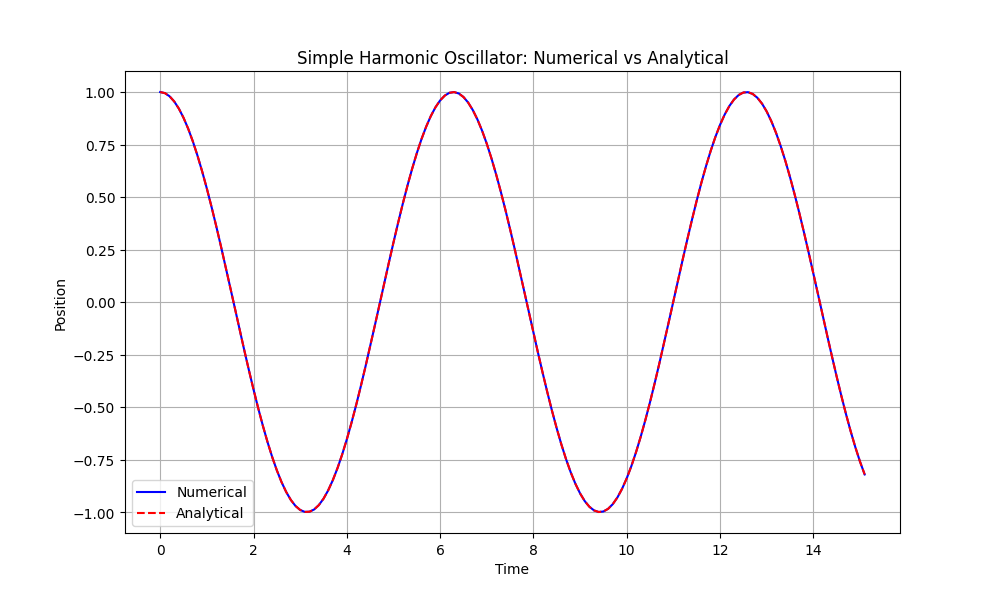
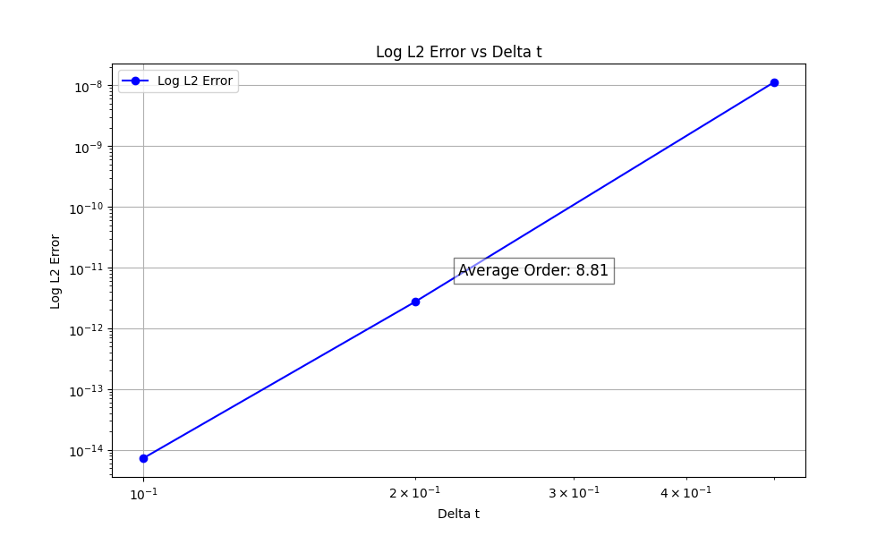

# Aligrator
[](https://github.com/alexlovric/aligrator/actions/workflows/build&test.yml)

A lightweight, dependency-free Rust library for numerical integration of ordinary differential equations (ODEs). Supports multiple Runge-Kutta multistage integrators and is easily extensible.

## Features
- Forward Euler
- Rk4, Rk45, Rk89
- Adaptive time-stepping

## Example: Solving a Simple Harmonic Oscillator

This example demonstrates how to use Aligrator to solve the initial value problem (IVP) for a simple 1D harmonic oscillator (SHO) with equation of motion:
$$
x''(t) + \omega^2x(t) = 0
$$

### 1. Define the ODE System
```rust
/// Simple Harmonic Oscillator (SHO) implementation.
struct SimpleHarmonicOscillator {
    omega: f64,
}

impl IvpFunction<1> for SimpleHarmonicOscillator {
    fn compute(&mut self, t: &f64, x: &[f64; 1], xdot: &[f64; 1]) -> [f64; 1] {
        // x''(t) = -ω²x(t)
        [-self.omega.powi(2) * x[0]]
    }
}
```
- Note: Aligrator requires that you implement the `IvpFunction` trait for your ODE system.

### 2. Set Initial Conditions
```rust
let x0 = [1.0];      // Initial position
let xdot0 = [0.0];   // Initial velocity
let t0 = 0.0;        // Start time
let tf = 15.0;       // End time
let dt = 1.0;        // Initial time step
```

### 3. Choose and Configure the Integrator
```rust
let mut integrator = Rk89::new(dt, None); // Adaptive disabled (second argument)
```
- Here we use the high-order Runge-Kutta 8/9 method.
- For adaptive time-stepping, pass `Some(AdaptiveDt::new(Some(1e-6), None, None))` as the second argument. Here the first argument is tolerance, the second is minimum time step, and the third is maximum time step.

### 4. Integrate the System
```rust
let (times, positions, _) = integrate(
    &mut integrator,
    &mut SimpleHarmonicOscillator { omega: 1.0 },
    x0,
    xdot0,
    t0,
    tf,
);
```
- Solves the IVP from `t0` to `tf`.
- Returns time points, positions, and velocities (not used here).
- Here we use the integrate function to manage the looping, but you can easily just call the `integrator.step(...)` in your own integration loop.

The response should look like this:


If we check the accuracy, its consistent with what we expect from this integrator:


### 6. Run the Example
Build and run the example with:
```sh
cargo run --example sho_response
```

## License
MIT
